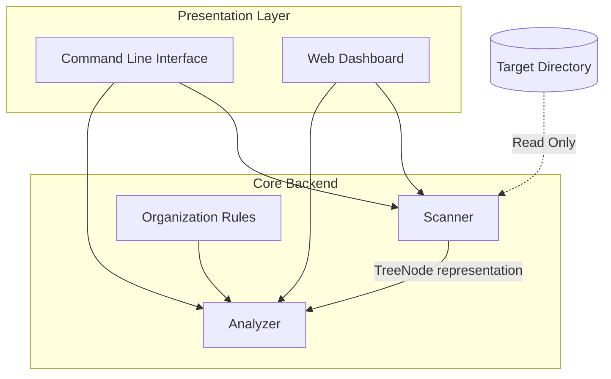

# TidyTree Design Choices

This document outlines the architectural decisions, design patterns, and tech stack choices for **TidyTree**, an intelligent directory organization assistant.

## 1. Architectural Principles

TidyTree is designed with a strict separation of concerns to ensure testability, maintainability, and extensibility.



- **Safety First (Read-Only)**: The backend code only performs read operations on the target filesystem. It never performs `write`, `delete`, or `move` operations on the source folder.
- **Decoupled Architecture**: The core package contains the parsing, scanning, and analysis engine. The CLI (`cli.py`) and Web Dashboard (`web.py`) are thin presentation layers that consume the core backend APIs.
- **Rule-Based Extensible Analyzer**: The Analyzer uses a pipeline of organization rules (e.g., deep nesting flattening, file grouping, and OneNote/Stratus pattern matching).

---

## 2. Data Models

The system uses standard Python dataclasses/Pydantic models to represent structures. This ensures strong typing and seamless JSON serialization for both CLI stdout and Web APIs.

### Tree Representation
```python
class FileMetadata(BaseModel):
    size: int
    modified_time: float
    extension: str
    mime_type: Optional[str] = None
    title_override: Optional[str] = None # For matching GUIDs from Stratus metadata

class TreeNode(BaseModel):
    name: str
    path: str  # Relative path from root
    is_dir: bool
    size: int = 0
    children: Optional[List["TreeNode"]] = None
    metadata: Optional[FileMetadata] = None
```

### Advisory Representation
```python
class Rationale(BaseModel):
    action: str  # e.g., "MOVE", "FLATTEN", "GROUP", "RENAME"
    original_path: str
    suggested_path: str
    reasoning: str

class TidyResult(BaseModel):
    original_tree: TreeNode
    suggested_tree: TreeNode
    rationales: List[Rationale]
```

---

## 3. Core Engine Mechanics

### Scanner
- Walks the directory recursively up to a configurable maximum depth.
- Reads file metadata (size, mod time, extension).
- Scans text files or metadata files (like JSON/XML) when matching enterprise software patterns like OneNote or Stratus:
  - **Stratus exports**: Often contain metadata files associating a UUID-named file (e.g. `1234-abcd-5678.pdf`) with a human-readable title. The scanner reads these metadata files to capture the real title.
  - **OneNote exports**: Contain sections as `.one` files and attachments/media in corresponding directories. The scanner groups these subfolders logically to avoid scattering attachments.

### Analyzer
The Analyzer runs the scanned tree through three main simplification pipelines:
1. **Unnesting (Flattening)**: Removes redundant, single-child directories (e.g., `/A/B/C/file.txt` -> `/A/file.txt` with a rationale pointing out excessive nesting).
2. **Grouping**: Categorizes loose files in flat directories into standard folders (`Documents`, `Source Code`, `Data`, `Media`, `Archives`) based on file extension and mime-type.
3. **Enterprise Resolver (OneNote/Stratus)**:
   - Renames UUID-based filenames to human-readable titles based on matching metadata files.
   - Cleans up OneNote attachment directories, grouping them directly alongside their parent notebook/section pages.

---

## 4. Environment & API Key Resolution (`dotenv_loader.py`)

To simplify API key configuration when utilizing Google Gemini or OpenAI GPT models for advanced sorting:
- **Automatic `.env` Discovery**: TidyTree checks for a `.env` file containing API keys (`GEMINI_API_KEY`, `OPENAI_API_KEY`) at three levels:
  1. The target folder being scanned.
  2. The current working directory (CWD) where the application is executed.
  3. The workspace root folder (containing `main.py`).
- **Standard Library Loading**: Parses and loads these key-value pairs directly into `os.environ` without adding heavy third-party dependencies, adhering to the project's zero-dependency-creep guideline.

---

## 5. Presentation Layers

### CLI (`cli.py`)
- Headless execution.
- Command options:
  - `--path` / `-p`: Root directory to scan.
  - `--format` / `-f`: Format of output (`text`, `json`, `markdown`).
  - `--max-depth` / `-d`: Max recursion depth (default 5).
  - `--taxonomy` / `-t`: Structure template (e.g. `generic`, `government`, `corporate`, `academic`).
  - `--guidance` / `-g`: Over-arching organizational guidelines (optional).
  - `--provider`: AI reorganization provider (`none`, `gemini`, `openai`).
  - `--api-key`: API key override.
  - `--model`: Specific AI model override.
- Outputs a clean text tree of the suggested hierarchy, followed by a list of rationales and a warning that no files were modified.

### Web Dashboard (`web.py` + static files)
- Built using **FastAPI** serving a modern, custom CSS/HTML/JS SPA.
- Decoupled, asynchronous REST endpoints for:
  - `/api/scan`: Initiates a scan and returns `TidyResult`.
- **UI Design System**:
  - Dark mode aesthetic with deep slate/violet gradients and subtle glassmorphic panels.
  - Interactive "Before" and "After" trees displayed side-by-side.
  - Interactive node clicking/hovering highlights corresponding reorganization rationales.
  - Custom collapsible folder trees built from scratch with CSS/JS for maximum smoothness and styling freedom.
- **Dynamic Help & Configuration Guide**: A built-in modal provides instant references for all the taxonomy templates (e.g., policy, operations, financial folders) and explains interface search/charts features.
- **Real-Time Directory Search**: Client-side filtering fades non-matching files, outlines matches, and automatically expands parent directories to expose items matching the user's query instantly.
- **Symbolic Views & Metrics**:
  - A metrics bar shows side-by-side counts comparing original vs. suggested files, folders, and maximum depth.
  - An animated horizontal bar chart illustrates the logical category weight distributions (e.g. Finance, Documents, Media) for the tidy tree structure.

